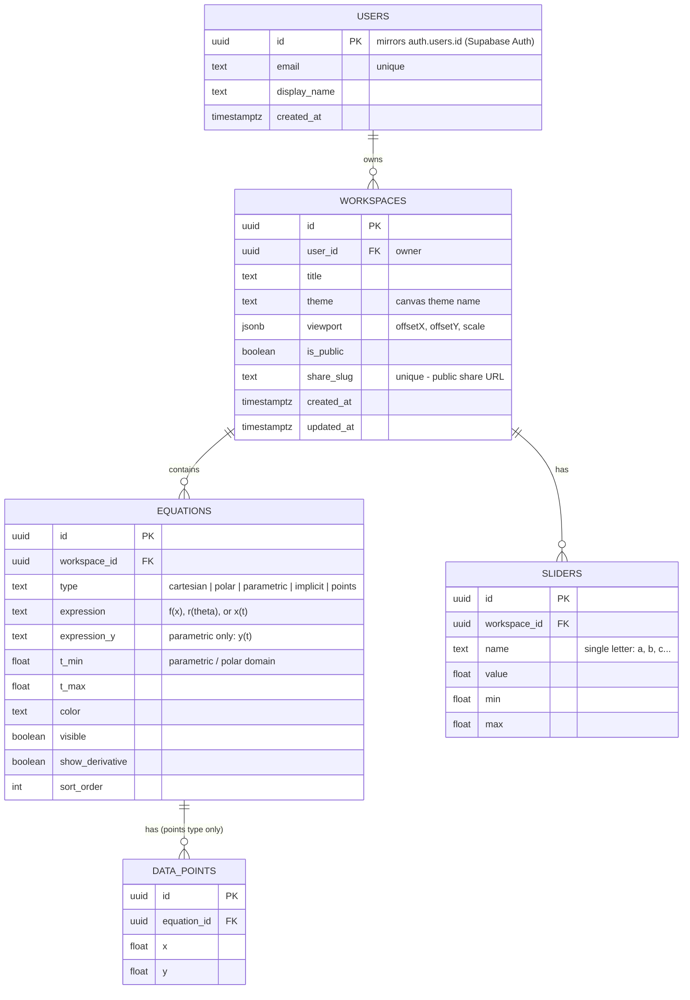

# QuickPlot — ERD & Wireframe

> Group 09 · SWE 4404 – Software Project Lab II
> The wireframe documents the **implemented** UI (`apps/web`).
> The ERD is the **planned** Supabase (PostgreSQL) schema for the upcoming
> *save / share / auth* features — the current share-link is stateless
> (equations are base64-encoded into the URL hash, no database involved).

---

## 1. Entity-Relationship Diagram (planned Supabase schema)



### Relationships (cardinality)

| Relationship | Type | Meaning |
|---|---|---|
| USERS → WORKSPACES | 1 : N | a user owns many saved graphs |
| WORKSPACES → EQUATIONS | 1 : N | a workspace contains many equations |
| WORKSPACES → SLIDERS | 1 : N | saved slider values/ranges per workspace |
| EQUATIONS → DATA_POINTS | 1 : N | only for `points`-type entries (CSV/JSON imports, manual points) |

### Design notes

- `EQUATIONS` columns map 1-to-1 onto the existing `EquationEntry` TypeScript
  interface (`apps/web/src/features/equations/types.ts`), so saving a workspace
  is a straight serialization of current React state.
- `DATA_POINTS` is shown normalized (3NF). In practice large imports could be
  stored as a `jsonb points` column on `EQUATIONS` instead — one row per import
  — trading normal form for fewer rows. Both options are defensible.
- `share_slug` enables short public URLs (`/w/abc123`) once the DB exists;
  until then sharing is handled client-side via the URL hash.
- Supabase **Row Level Security** would enforce: owners can CRUD their own
  workspaces; everyone can read rows where `is_public = true`.

---

## 2. Wireframe — main screen (implemented)

```text
┌────────────────────────────────────────────────────────────────────────────────┐
│  QuickPlot / 2D                              [◉ special pts] [● Themes]  [⌂]  │  header
├──────────────────────────────────────────────────────────┬─────────────────────┤
│                                                          │ [»]  (collapse)     │
│                      CANVAS  (2D)                        │─────────────────────│
│        y ↑                                               │ EQUATIONS           │
│          │     ╭──╮          ╭──╮                        │ ┌─────────────────┐ │
│          │    ╱    ╲        ╱    ╲                       │ │ ● y= │sin(a·x) │ │
│   ───────┼───╱──────╲──────╱──────╲─────→ x              │ │   [f′] [▶] [✕] │ │
│          │  ╱        ╲    ╱        ╲                     │ └─────────────────┘ │
│          │ •root  ▲extremum  ■intersection               │ ┌─────────────────┐ │
│          │                                               │ │ ● r= │2cos(3θ) │ │
│          │                                               │ └─────────────────┘ │
│          │                                               │ [y=] [r=] [xy] [f=] │  add
│   drag = pan · scroll = zoom · dbl-click = reset         │─────────────────────│
│                                                          │ SLIDERS             │
│                                                          │  a  ──────●────  1.2│
│                                                          │  [min 0] [max 5] [▶]│  animate
│                                                          │─────────────────────│
│                                                          │ ADD POINT           │
│                                                          │  ( [x] , [y] )  [+] │
│                                                          │─────────────────────│
│                                                          │ DATA                │
│                                                          │  [↑ Upload JSON/CSV]│
│                                                          │─────────────────────│
│                                                          │ SHORTCUTS        ▼  │
│                                                          │─────────────────────│
│                                                          │ SHARE               │
│                                                          │  [⎘ Image] [⇗ Link] │
└──────────────────────────────────────────────────────────┴─────────────────────┘
```

### Region map

| # | Region | Component | What it does |
|---|---|---|---|
| 1 | Header | `App.tsx` | brand, special-points toggle, theme picker, reset view |
| 2 | Canvas | `features/canvas-2d/Canvas2D.tsx` | renders all curves; pan / zoom / reset; DPR-aware |
| 3 | Equation list | `features/equations/EquationRow.tsx` | color, type, expression input, derivative toggle, trace, delete |
| 4 | Add-equation row | `App.tsx` | one button per equation type (`y=`, `r=`, `xy`, `f=`) |
| 5 | Sliders | `features/sliders/SliderPanel.tsx` | auto-detected parameters, editable range, RAF animation |
| 6 | Add point | `App.tsx` | manual (x, y) input |
| 7 | Data upload | `App.tsx` | JSON / CSV / TSV → point datasets |
| 8 | Shortcuts | `App.tsx` | collapsible cheat-sheet |
| 9 | Share | `App.tsx` | copy canvas as image · copy URL-hash share link |

### Interaction states

- Sidebar collapses to a 7-px rail (`»` / `«` toggle).
- Equation parse errors show inline under the row — the canvas never crashes.
- Share buttons flash "✓ Done" on success.

---

## 3. Future screens (planned, not yet implemented)

```text
┌──────────────────────────────┐      ┌──────────────────────────────┐
│  Sign in to QuickPlot        │      │  My Workspaces               │
│                              │      │  ┌────────┐ ┌────────┐       │
│  email    [______________]   │      │  │ Trig   │ │ Conics │  ...  │
│  password [______________]   │      │  │ demo   │ │ HW 3   │       │
│                              │      │  └────────┘ └────────┘       │
│  [ Sign in ]  [ Sign up ]    │      │  [+ New]  [Open] [Delete]    │
│  (Supabase Auth)             │      │  (reads WORKSPACES table)    │
└──────────────────────────────┘      └──────────────────────────────┘
```
